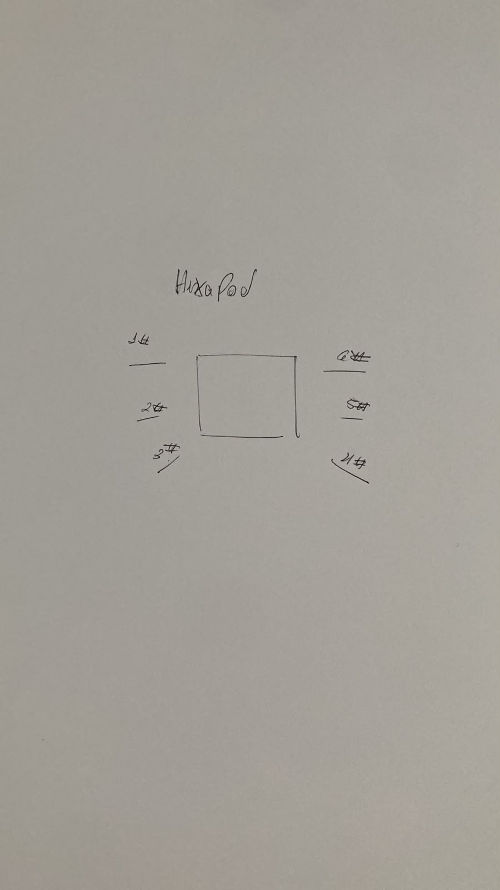

### Tabela de Conexões (Pinos de Sinal PWM)

| Perna | Articulação (Servo) | Pino ESP32 (GPIO) | Observação |
| :--- | :--- | :--- | :--- |
| **Perna 1** | Base (Coxa) | GPIO 4 | |
| | Meio (Fêmur) | GPIO 5 | Pino de strapping (veja nota abaixo) |
| | Ponta (Tíbia) | GPIO 13 | |
| **Perna 2** | Base (Coxa) | GPIO 14 | |
| | Meio (Fêmur) | GPIO 15 | Pino de strapping |
| | Ponta (Tíbia) | GPIO 16 | |
| **Perna 3** | Base (Coxa) | GPIO 17 | |
| | Meio (Fêmur) | GPIO 18 | |
| | Ponta (Tíbia) | GPIO 19 | |
| **Perna 4** | Base (Coxa) | GPIO 21 | |
| | Meio (Fêmur) | GPIO 22 | |
| | Ponta (Tíbia) | GPIO 23 | |
| **Perna 5** | Base (Coxa) | GPIO 25 | |
| | Meio (Fêmur) | GPIO 26 | |
| | Ponta (Tíbia) | GPIO 27 | |
| **Perna 6** | Base (Coxa) | GPIO 32 | |
| | Meio (Fêmur) | GPIO 33 | |
| | Ponta (Tíbia) | GPIO 2 | Pino de strapping |

